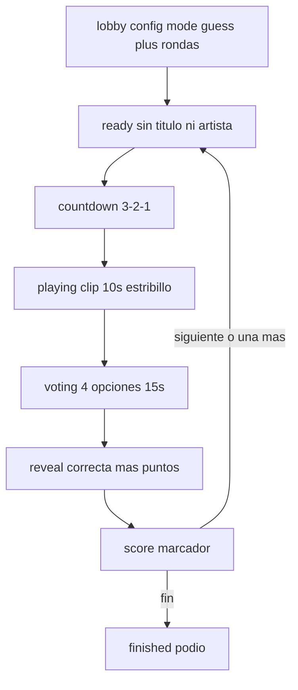

# Adivina la canción Implementation Plan

> **For agentic workers:** REQUIRED SUB-SKILL: Use superpowers:subagent-driven-development (recommended) or superpowers:executing-plans to implement this plan task-by-task. Steps use checkbox (`- [ ]`) syntax for tracking.

**Goal:** Añadir el modo **Adivina la canción**: el host pone el instrumental de karaoke (sin letra ni título), suenan 10 s desde el estribillo y todos los jugadores eligen entre 4 títulos en el teléfono; quien acierta más rápido suma más puntos.

**Architecture:** Un módulo puro en `@slay-it/shared` arma clip, distractores y puntuación. `RoomManager` reutiliza las fases `ready → countdown → playing → voting → reveal → score` (sin cantante). Tras el clip se abren las opciones; al cerrar la ventana se revela la correcta y se pasa al marcador. El audio sigue sonando solo en la TV. No hace falta tocar Supabase: el MP3 del karaoke **es** la pista.

**Tech Stack:** TypeScript, `RoomManager` + Zod, React/Vite, Supabase Realtime (`RoomCommand`), Vitest.

## Global Constraints

- `GameConfig.mode` nuevo valor: `"guess"` (copy UI: «Adivina la canción»).
- Rondas: reutilizar `totalRounds` 1–12; no añadir otro stepper.
- Clip fijo: **10 s** desde `song.chorusStart`; si no caben, desplazar el inicio hacia atrás (`max(0, duration - 10)`).
- **4** opciones. Label = `title`; si dos de las 4 comparten título, esas van como `title — artist`.
- Canción correcta: sorteo del setlist (o `selectedSongId`), igual que hoy. Distractores: catálogo registrado completo (demo + `registerSongs`), no placeholders, preferir mismo `genre`.
- Hacen falta **≥ 4 canciones reales** en la biblioteca para empezar; si no, `start()` lanza: `Se necesitan al menos 4 canciones en la biblioteca para Adivina la canción.`
- Este modo **exige audio in-app** en la TV (el MP3 de karaoke). Sin archivo no se puede buscar en Spotify: spoilearía la respuesta. Ready deshabilita el 3-2-1 si `!hostHasAudio`.
- Puntuación Kahoot: acierto = `round(1000 - (elapsed/15000) * 500)` → 1000 al instante, 500 al límite; fallo o sin respuesta = 0. Ventana de respuesta fija: **15 s**. Reveal en TV: **4 s**.
- Todos los jugadores de `players` responden (el host-TV no juega). Primera respuesta se bloquea; no se puede cambiar.
- Durante `ready|countdown|playing|voting` no se muestran título, artista ni letra. `publish()` emite estado sanitizado (`sanitizeGuessState`).
- No hay pista instrumental separada ni migración SQL. Fuera de alcance: `apps/server` Socket.IO (no se usa en Pages).

---

## File structure

- Create: [packages/shared/src/guess.ts](packages/shared/src/guess.ts) — clip, labels, pregunta, score, sanitizado.
- Create: [packages/shared/src/guess.test.ts](packages/shared/src/guess.test.ts)
- Create: [packages/shared/src/engine.guess.test.ts](packages/shared/src/engine.guess.test.ts)
- Modify: [packages/shared/src/model.ts](packages/shared/src/model.ts) — enum `guess` + tipos + campos de `RoomPublicState`.
- Modify: [packages/shared/src/index.ts](packages/shared/src/index.ts) — `export * from "./guess.js"`.
- Modify: [packages/shared/src/engine.ts](packages/shared/src/engine.ts) — `prepareRound`, clip timer, `answer`, `resolveGuess`, disconnect.
- Modify: [apps/web/src/realtime/protocol.ts](apps/web/src/realtime/protocol.ts) — comando `answer`.
- Modify: [apps/web/src/game/hostEngine.ts](apps/web/src/game/hostEngine.ts) + [apps/web/src/game/hostEngine.test.ts](apps/web/src/game/hostEngine.test.ts)
- Modify: [apps/web/src/App.tsx](apps/web/src/App.tsx) — lobby, Ready/Countdown/Listen, voto 2×2, reveal, score, pausar audio al pasar a `voting`.
- Modify: [apps/web/src/styles.css](apps/web/src/styles.css) — grid Kahoot (rojo / azul / amarillo / verde).
- Modify: [README.md](README.md) — sección del modo (dentro de la última tarea de UI).



---

### Task 1: Helpers puros del quiz

**Files:**
- Create: `packages/shared/src/guess.ts`
- Create: `packages/shared/src/guess.test.ts`
- Modify: `packages/shared/src/index.ts` (añadir `export * from "./guess.js";`)

**Interfaces:**
- Consumes: `Song`, `RoomPublicState`, `isPlaceholderSong` desde [packages/shared/src/game.ts](packages/shared/src/game.ts)
- Produces: constantes y funciones de abajo (el motor y la UI no inventan otros nombres)

```ts
export const GUESS_CLIP_SECONDS = 10;
export const GUESS_OPTION_COUNT = 4;
export const GUESS_MAX_POINTS = 1000;
export const GUESS_MIN_POINTS = 500;
export const GUESS_ANSWER_WINDOW_MS = 15_000;
export const GUESS_REVEAL_MS = 4_000;

export function selectGuessClip(song: Pick<Song, "chorusStart" | "duration">): { clipStart: number; clipEnd: number };
export function guessOptionLabel(song: Pick<Song, "title" | "artist">, siblings: Array<Pick<Song, "title">>): string;
export function buildGuessQuestion(correct: Song, pool: Song[], random?: () => number): GuessQuestion;
export function scoreGuessAnswer(correct: boolean, answeredAt: number, windowStartedAt: number, windowMs?: number): number;
export function sanitizeGuessState(state: RoomPublicState): RoomPublicState;
```

- [ ] **Step 1: Test que falla** — crear `guess.test.ts` con fixtures `createFixtureSong` (cuatro temas; dos con título `Cielito Lindo` y artistas distintos).

```ts
import { describe, expect, it } from "vitest";
import { createFixtureSong } from "./testFixtures.js";
import {
  GUESS_CLIP_SECONDS,
  buildGuessQuestion,
  guessOptionLabel,
  sanitizeGuessState,
  scoreGuessAnswer,
  selectGuessClip,
} from "./guess.js";
import { defaultGameConfig, type RoomPublicState } from "./model.js";

const short = createFixtureSong("short", { title: "Corta" });
// chorusStart de fixture ≈ sección 3; duration es grande. Para el borde:
it("selectGuessClip recorta si el estribillo no deja 10s", () => {
  const clip = selectGuessClip({ chorusStart: 95, duration: 100 });
  expect(clip.clipStart).toBe(90);
  expect(clip.clipEnd).toBe(100);
});

it("selectGuessClip usa chorusStart cuando cabe", () => {
  const clip = selectGuessClip({ chorusStart: 20, duration: 180 });
  expect(clip).toEqual({ clipStart: 20, clipEnd: 20 + GUESS_CLIP_SECONDS });
});

it("guessOptionLabel añade artista solo si el título choca", () => {
  expect(guessOptionLabel({ title: "La Bamba", artist: "Ritchie" }, [{ title: "Cielito Lindo" }])).toBe("La Bamba");
  expect(guessOptionLabel({ title: "Cielito Lindo", artist: "Pedro" }, [{ title: "Cielito Lindo" }])).toBe(
    "Cielito Lindo — Pedro",
  );
});

it("buildGuessQuestion arma 4 opciones con la correcta y falla con menos de 3 distractores", () => {
  const songs = [
    createFixtureSong("g1", { title: "Uno", artist: "A", genre: "ranchera" }),
    createFixtureSong("g2", { title: "Dos", artist: "B", genre: "ranchera" }),
    createFixtureSong("g3", { title: "Tres", artist: "C", genre: "pop" }),
    createFixtureSong("g4", { title: "Uno", artist: "D", genre: "ranchera" }),
  ];
  const question = buildGuessQuestion(songs[0]!, songs, () => 0);
  expect(question.options).toHaveLength(4);
  expect(question.correctOptionId).toBe("g1");
  expect(new Set(question.options.map((o) => o.id)).size).toBe(4);
  const unoLabels = question.options.filter((o) => o.id === "g1" || o.id === "g4").map((o) => o.label);
  expect(unoLabels.every((label) => label.includes("—"))).toBe(true);
  expect(() => buildGuessQuestion(songs[0]!, songs.slice(0, 3), () => 0)).toThrow(
    "Se necesitan al menos 4 canciones en la biblioteca para Adivina la canción.",
  );
});

it("scoreGuessAnswer es Kahoot 1000–500", () => {
  expect(scoreGuessAnswer(false, 1000, 0)).toBe(0);
  expect(scoreGuessAnswer(true, 0, 0)).toBe(1000);
  expect(scoreGuessAnswer(true, 15_000, 0)).toBe(500);
  expect(scoreGuessAnswer(true, 7_500, 0)).toBe(750);
});

it("sanitizeGuessState oculta spoiler hasta reveal", () => {
  const song = createFixtureSong("g1", { title: "Secreto", artist: "X" });
  const base = {
    config: { ...defaultGameConfig, mode: "guess" as const },
    phase: "voting" as const,
    song,
    guessQuestion: {
      options: [{ id: "g1", label: "Secreto" }],
      correctOptionId: "g1",
      clipStart: 10,
      clipEnd: 20,
    },
  } as RoomPublicState;
  const hidden = sanitizeGuessState(base);
  expect(hidden.song?.title).toBe("???");
  expect(hidden.song?.artist).toBe("???");
  expect(hidden.song?.lines.every((line) => line.text.trim() === "")).toBe(true);
  expect(hidden.guessQuestion?.correctOptionId).toBe("");
  expect(sanitizeGuessState({ ...base, phase: "reveal" }).guessQuestion?.correctOptionId).toBe("g1");
  expect(sanitizeGuessState({ ...base, config: defaultGameConfig }).song?.title).toBe("Secreto");
});
```

Nota: `GuessQuestion` se define en Task 2; en Task 1 declara el tipo en `guess.ts` **o** importa desde `model.ts` si Task 1 y 2 se commitean juntas. Implementar Task 1+2 en el mismo ciclo si el typecheck exige el tipo en `model.ts` primero.

- [ ] **Step 2: Correr test y ver FAIL**

Run: `npx vitest run packages/shared/src/guess.test.ts`
Expected: FAIL — `Cannot find module './guess.js'`

- [ ] **Step 3: Implementación mínima**

`buildGuessQuestion`: filtrar `pool` con `id !== correct.id && !isPlaceholderSong`; si `length < 3` lanzar el error de arriba; barajar primero mismo `genre` y luego el resto (`shuffle` Fisher–Yates con `random`); tomar 3; barajar `[correct, ...distractors]`; `options[].id = song.id`; labels con `guessOptionLabel(song, songsElegidas)`; clip con `selectGuessClip(correct)`.

`sanitizeGuessState`: si `mode !== "guess"` devolver `state`; si `phase` está en `ready|countdown|playing|voting`, clonar y poner `title/artist` a `"???"`, `lines[].text` a `" "`, `correctOptionId` a `""`.

- [ ] **Step 4: Tests PASS** — mismo comando, Expected: PASS

- [ ] **Step 5: Commit** `feat: add guess-mode quiz helpers`

---

### Task 2: Tipos en el modelo

**Files:**
- Modify: `packages/shared/src/model.ts` (schema ~141–166 y `RoomPublicState` ~211–270)
- Modify: `packages/shared/src/engine.ts` `create()` (~117–144) para inicializar los campos nuevos (si no, `start` rompe)

**Interfaces:**
- Consumes: Task 1
- Produces:

```ts
export interface GuessOption {
  id: string;
  label: string;
}

export interface GuessQuestion {
  options: GuessOption[];
  correctOptionId: string;
  clipStart: number;
  clipEnd: number;
}

export interface GuessAnswer {
  optionId: string;
  answeredAt: number;
}
```

En `gameConfigSchema`: `mode: z.enum(["individual", "relay", "karaoke", "guess"])`.

En `RoomPublicState` añadir (siempre presentes, `null`/vacío fuera de guess):

- `guessQuestion: GuessQuestion | null`
- `guessAnswers: Record<string, GuessAnswer>`
- `guessWindowStartedAt: number | null`
- `guessDeadlineAt: number | null`
- `lastGuessPoints: Record<string, number> | null`

En `create()`: `guessQuestion: null`, `guessAnswers: {}`, `guessWindowStartedAt: null`, `guessDeadlineAt: null`, `lastGuessPoints: null`.

- [ ] **Step 1: Test de contrato** — en `guess.test.ts` (o un `model` assert) crear un `RoomPublicState` mínimo y comprobar que TypeScript exige los campos. El test runtime: `expect(defaultGameConfig.mode).toBe("relay")` y que `"guess"` es asignable a `GameConfig["mode"]`.

- [ ] **Step 2: FAIL** si el enum aún no incluye `guess` (typecheck: `npx tsc -p packages/shared --noEmit`)

- [ ] **Step 3: Editar `model.ts` y `create()`** exactamente como arriba. No cambiar `defaultGameConfig.mode`.

- [ ] **Step 4:** `npx vitest run packages/shared/src/engine.test.ts packages/shared/src/engine.p5.test.ts` — Expected: PASS (los campos extra no rompen tests viejos si `create()` los inicializa).

- [ ] **Step 5: Commit** `feat: add guess mode types to room state`

---

### Task 3: Motor — preparar ronda y validar biblioteca

**Files:**
- Modify: `packages/shared/src/engine.ts` — `start()`, `prepareRound()`, helper `catalogForGuess(room)`
- Create: `packages/shared/src/engine.guess.test.ts`

**Interfaces:**
- Consumes: `buildGuessQuestion`, `selectGuessClip` (vía question), `GUESS_*`
- Produces: `RoomManager` deja `guessQuestion` + `startPosition = clipStart`, `singerId = null`, `blackout = null`, `relayPlan = null`

En `start()` / `extendRound()`, si `config.mode === "guess"`:

```ts
const catalog = this.catalogForGuess(); // demoSongs + externalSongs, sin placeholders
if (catalog.length < GUESS_OPTION_COUNT) {
  throw new Error("Se necesitan al menos 4 canciones en la biblioteca para Adivina la canción.");
}
```

En `prepareRound()`, rama `else if (state.config.mode === "guess")` **antes** del else individual:

```ts
state.relayPlan = null;
state.activeTurnIndex = null;
state.blackout = null;
state.singerId = null;
state.guessQuestion = buildGuessQuestion(state.song, this.catalogForGuess());
state.startPosition = state.guessQuestion.clipStart;
state.guessAnswers = {};
state.guessWindowStartedAt = null;
state.guessDeadlineAt = null;
state.lastGuessPoints = null;
```

Resetear esos campos también en las otras ramas (`null` / `{}`) para no filtrar estado de una ronda guess a un modo viejo si alguien reconfigura… no aplica mid-game; igual resetear en `prepareRound` al final para todos los modos.

`vote()` y `voteStars()`: si `mode === "guess"`, throw `"Esta partida se responde con opciones"`.
`resolveManually()`: si `mode === "guess"`, throw `"Adivina la canción no usa resolución manual"`.

- [ ] **Step 1: Test que falla** en `engine.guess.test.ts` (registrar **4** fixtures; `createTestRooms` de P5 solo tiene 3):

```ts
function guessRooms() {
  const published: RoomPublicState[] = [];
  const rooms = new RoomManager((_c, s) => published.push(s));
  rooms.registerSongs([
    createFixtureSong("g1", { title: "Uno", artist: "A", genre: "ranchera" }),
    createFixtureSong("g2", { title: "Dos", artist: "B", genre: "ranchera" }),
    createFixtureSong("g3", { title: "Tres", artist: "C", genre: "pop" }),
    createFixtureSong("g4", { title: "Cuatro", artist: "D", genre: "cumbia" }),
  ]);
  return { rooms, published };
}

it("start en guess exige 4 canciones y no asigna cantante", () => {
  const few = new RoomManager(() => {});
  few.registerSongs([createFixtureSong("a"), createFixtureSong("b"), createFixtureSong("c")]);
  const code = few.create("host", "TV").code;
  few.configure(code, "host", { ...defaultGameConfig, mode: "guess", totalRounds: 3 });
  few.join(code, "p1", "Ada");
  few.join(code, "p2", "Lin");
  expect(() => few.start(code, "host")).toThrow("al menos 4 canciones");

  const { rooms } = guessRooms();
  const created = rooms.create("host", "TV");
  rooms.configure(created.code, "host", { ...defaultGameConfig, mode: "guess", totalRounds: 3 });
  rooms.join(created.code, "p1", "Ada");
  rooms.join(created.code, "p2", "Lin");
  rooms.start(created.code, "host");
  const state = rooms.get(created.code)!;
  expect(state.phase).toBe("ready");
  expect(state.totalRounds).toBe(3);
  expect(state.singerId).toBeNull();
  expect(state.blackout).toBeNull();
  expect(state.guessQuestion?.options).toHaveLength(4);
  expect(state.startPosition).toBe(state.guessQuestion!.clipStart);
});
```

- [ ] **Step 2:** `npx vitest run packages/shared/src/engine.guess.test.ts` — FAIL (`mode: "guess"` inválido o `guessQuestion` undefined)

- [ ] **Step 3: Implementar rama y validación**

- [ ] **Step 4:** PASS + `npx vitest run packages/shared/src/engine.test.ts packages/shared/src/engine.p5.test.ts` sigue verde

- [ ] **Step 5: Commit** `feat: prepare guess rounds from karaoke catalog`

---

### Task 4: Motor — clip, respuestas y puntuación

**Files:**
- Modify: `packages/shared/src/engine.ts` — `beginPlayback`, `answer`, `openGuessVoting`, `resolveGuess`, `closeGuessVoting`, `disconnect`
- Modify: `packages/shared/src/engine.guess.test.ts`

**Interfaces:**
- Consumes: `scoreGuessAnswer`, `GUESS_ANSWER_WINDOW_MS`, `GUESS_REVEAL_MS`
- Produces:

```ts
class RoomManager {
  answer(code: string, playerId: string, optionId: string): void;
  closeGuessVoting(code: string, actorId: string): void;
}
```

`beginPlayback`: al final, si `mode === "guess"`, `scheduleGuessClipEnd(room)`:

```ts
const delay = Math.max(
  0,
  startedAt + (guessQuestion.clipEnd - startPosition) * 1000 - playbackOffsetMs - Date.now(),
);
this.setTimer(room, delay, () => this.openGuessVoting(room));
```

`openGuessVoting`: `phase = "voting"`, `guessAnswers = {}`, `guessWindowStartedAt = Date.now()`, `guessDeadlineAt = now + 15000`, publish, timer 15 s → `resolveGuess`.

`answer`:
- `mode !== "guess"` → `"Esta partida no es Adivina la canción"`
- `phase !== "voting"` → `"Las opciones todavía no están abiertas"`
- jugador no en sala → error existente
- ya hay `guessAnswers[playerId]` → `"Ya respondiste"`
- `optionId` no está en `guessQuestion.options` → `"Esa opción no existe"`
- guardar `{ optionId, answeredAt: Date.now() }`, publish
- si `Object.keys(guessAnswers).length >= players.length` → `resolveGuess`

`resolveGuess`:
- para cada player: puntos con `scoreGuessAnswer(optionId === correctOptionId, answeredAt, guessWindowStartedAt)` o 0 si no contestó
- `player.score += pts`; `lastGuessPoints = points`; `lastResult = some pts > 0`
- `phase = "reveal"`; `revealEndsAt = now + 4000`; timer → `phase = "score"`, `revealEndsAt = null`

`closeGuessVoting`: solo host, `mode === "guess"` y `phase === "voting"` → `resolveGuess` (como `closeKaraokeVoting`).

`disconnect`: `delete room.state.guessAnswers[playerId]`. Si `mode === "guess"` y `ACTIVE_ROUND_PHASES` y `players.length < 2` → `finished` / `not_enough_players`. Si `phase === "voting"` y los que quedan ya contestaron todos → `resolveGuess`.

- [ ] **Step 1: Tests** (timers fake, `setSystemTime(10_000)`):

```ts
function playingGuess() {
  const { rooms } = guessRooms();
  const code = rooms.create("host", "TV").code;
  rooms.configure(code, "host", { ...defaultGameConfig, mode: "guess" });
  rooms.join(code, "p1", "Ada");
  rooms.join(code, "p2", "Lin");
  rooms.setHostHasAudio(code, "host", true);
  rooms.start(code, "host");
  rooms.startCountdown(code, "host");
  vi.advanceTimersByTime(3_000);
  rooms.hostConfirmPlaybackStarted(code, "host", rooms.get(code)!.startPosition);
  return { rooms, code };
}

it("tras 10s de clip abre votación; responder mal da 0; el más rápido gana más", () => {
  const { rooms, code } = playingGuess();
  vi.advanceTimersByTime(GUESS_CLIP_SECONDS * 1000);
  const open = rooms.get(code)!;
  expect(open.phase).toBe("voting");
  expect(open.guessDeadlineAt).toBe(Date.now() + GUESS_ANSWER_WINDOW_MS);

  const correct = open.guessQuestion!.correctOptionId;
  const wrong = open.guessQuestion!.options.find((o) => o.id !== correct)!.id;
  rooms.answer(code, "p1", correct);
  vi.advanceTimersByTime(4_000);
  rooms.answer(code, "p2", correct);
  const revealed = rooms.get(code)!;
  expect(revealed.phase).toBe("reveal");
  expect(revealed.lastGuessPoints!["p1"]).toBeGreaterThan(revealed.lastGuessPoints!["p2"]!);
  expect(revealed.players.find((p) => p.id === "p1")!.score).toBe(revealed.lastGuessPoints!["p1"]);

  const { rooms: r2, code: c2 } = playingGuess();
  vi.advanceTimersByTime(GUESS_CLIP_SECONDS * 1000);
  r2.answer(c2, "p1", r2.get(c2)!.guessQuestion!.options.find((o) => o.id !== r2.get(c2)!.guessQuestion!.correctOptionId)!.id);
  expect(() => r2.answer(c2, "p1", r2.get(c2)!.guessQuestion!.correctOptionId)).toThrow("Ya respondiste");
  vi.advanceTimersByTime(GUESS_ANSWER_WINDOW_MS);
  expect(r2.get(c2)!.lastGuessPoints!["p1"]).toBe(0);
  expect(r2.get(c2)!.lastGuessPoints!["p2"]).toBe(0);
});
```

(Ajustar el segundo caso: `wrong` en vez de la expresión larga.)

- [ ] **Step 2:** FAIL — `answer is not a function`

- [ ] **Step 3: Implementar métodos**

- [ ] **Step 4:** PASS

- [ ] **Step 5: Commit** `feat: score guess answers with kahoot timing`

---

### Task 5: Sanitizar broadcast (anti-spoiler)

**Files:**
- Modify: `packages/shared/src/engine.ts` `publish()`
- Modify: `packages/shared/src/engine.guess.test.ts`

`publish` queda:

```ts
this.emitState(room.state.code, sanitizeGuessState(structuredClone(room.state)));
```

`rooms.get()` sigue siendo el estado interno (título real, `correctOptionId` lleno). Los tests de spoiler miran el array `published`.

- [ ] **Step 1:**

```ts
it("el broadcast oculta título y correcta hasta reveal", () => {
  const { rooms, published } = guessRooms();
  // ... start hasta ready
  const last = published.at(-1)!;
  expect(last.song?.title).toBe("???");
  expect(last.guessQuestion?.correctOptionId).toBe("");
  expect(rooms.get(code)!.song?.title).not.toBe("???");
});
```

- [ ] **Step 2–4:** FAIL (published tiene el título) → cambiar `publish` → PASS
- [ ] **Step 5: Commit** `fix: hide guess spoilers in published room state`

---

### Task 6: Protocolo Realtime y hostEngine

**Files:**
- Modify: `apps/web/src/realtime/protocol.ts`
- Modify: `apps/web/src/game/hostEngine.ts`
- Modify: `apps/web/src/game/hostEngine.test.ts`

**Interfaces:**
- Consumes: `RoomManager.answer`, `closeGuessVoting`
- Produces:

```ts
| { type: "answer"; requestId: string; playerId: string; optionId: string }
```

En `handleRemoteCommand`: tratar `answer` como `vote`/`voteStars` para el check de Presence; llamar `manager.answer(code, command.playerId, command.optionId)`.

Exponer `closeGuessVoting: () => guarded(() => manager.closeGuessVoting(code, hostId))`.

Registrar 4 canciones en el test de hostEngine (el sample actual es 1).

- [ ] **Step 1:** test `handleRemoteCommand({ type: "answer", ... })` en una sala guess en `voting` suma puntos. FAIL: tipo no existe / no despacha.
- [ ] **Step 3:** cablear comando + `closeGuessVoting`
- [ ] **Step 4:** `npx vitest run apps/web/src/game/hostEngine.test.ts` PASS
- [ ] **Step 5: Commit** `feat: accept guess answers over realtime`

---

### Task 7: Lobby y pantallas de ronda

**Files:**
- Modify: `apps/web/src/App.tsx` — `Lobby`, `Ready`, `Countdown`, fase `playing`, efecto de pausa (~1357), `castGuessAnswer`, switch de fases
- Modify: `apps/web/src/styles.css`
- Modify: `README.md` (después de «Modo karaoke por turnos»)

**Lobby** ([App.tsx](apps/web/src/App.tsx) ~489–542):
- `Choice` legend: «Modo de juego»; cuarta opción `["guess", "Adivina la canción"]`.
- Si `mode === "guess"`: ocultar máscara, voto grupal y cantantes karaoke. Nota: «Suena el instrumental 10 s desde el estribillo. Luego 4 opciones en el teléfono. Quien acierte más rápido suma más puntos.» Si `librarySongs.length < 4`, error visible y deshabilitar «Empezar show».
- Chip de espera del jugador: texto del modo guess.
- El stepper «Rondas de la noche» no se toca.

**Ready / Countdown** si `mode === "guess"`:
- Título: «¿Adivinas la canción?»
- No renderizar `song.title` / `song.artist` / quién canta.
- Host: exigir `hostAudio.hasAudio` para el 3-2-1 (`disabled={!canStart || !hostAudio.hasAudio}`).
- Copy: «Se oirá el instrumental unos 10 segundos. Nadie ve la letra.»

**playing:** no usar `Karaoke`. Nueva sección `GuessListen`: equalizer/barra de 10 s (`clipEnd - position`), texto «Escucha…», sin letra, sin calibración, sin «Terminar interpretación». Host: nudge de autoplay igual que hoy.

**Pausa de audio** en el `useEffect` de fases: hoy solo pausa si `playing → score|reveal|finished`. Añadir `voting` (si no, el clip sigue sonando encima de las opciones):

```ts
if (
  (state.phase === "score" || state.phase === "reveal" || state.phase === "voting" || state.phase === "finished") &&
  previousPhase === "playing"
) {
  hostAudio.pause();
}
```

**voting** si guess:
- TV (host): grid 2×2 con las 4 labels + contador `respuestas/jugadores` + countdown hasta `guessDeadlineAt` + «Cerrar ahora» → `closeGuessVoting`.
- Móvil: mismos 4 botones de color; al tocar → `sendPlayerCommand({ type: "answer", optionId })`; después, «Respuesta bloqueada».
- Colores fijos por índice: 0 rojo, 1 azul, 2 amarillo, 3 verde (clases `.guess-option--0` … `--3`).

**reveal** si guess:
- Mostrar título + artista reales (`rooms.get` ya no está sanitizado en esta fase).
- Marcar la opción correcta; lista «Ada +750 · Lin 0».
- Timer 4 s (el motor avanza solo; sin botones de «lo hizo»).

**score** si guess:
- Sello: no «¿Lo hizo el cantante?». Usar `lastGuessPoints` («Puntos de la ronda») y el marcador acumulado que ya existe.
- Seguir con «Siguiente ronda» / «Una más» / «Terminar show».

**App wiring:** `castGuessAnswer(optionId)` junto a `castVote`; pasar `onAnswer` / `onCloseGuessVoting` a `Voting`/`Reveal`.

CSS nuevo (mismos tokens `--pink`, `--cyan`):

```css
.guess-grid { display: grid; grid-template-columns: 1fr 1fr; gap: 12px; margin-top: 24px; }
.guess-option { min-height: 88px; border: 3px solid; font-weight: 800; }
.guess-option--0 { background: #e11d48; border-color: #e11d48; color: #fff; }
.guess-option--1 { background: #2563eb; border-color: #2563eb; color: #fff; }
.guess-option--2 { background: #eab308; border-color: #eab308; color: #111; }
.guess-option--3 { background: #16a34a; border-color: #16a34a; color: #fff; }
.guess-option.is-correct { outline: 4px solid #fff; }
.guess-option.is-locked { opacity: 0.55; }
.guess-listen { text-align: center; }
```

- [ ] **Step 1:** No hay harness de UI. El “test que falla” de esta tarea es typecheck: añadir las props nuevas y ver `npx tsc -p apps/web --noEmit` fallar hasta cablear `RoomCommand` / `closeGuessVoting`.
- [ ] **Step 3: Implementar UI + CSS + README**
- [ ] **Step 4:** `npx vitest run` + `npx tsc --noEmit` en workspaces. Verificar a mano (cuando se ejecute, no en este plan):
  1. Biblioteca ≥ 4 MP3 de karaoke.
  2. Lobby: modo Adivina + 3 rondas → empezar.
  3. TV no muestra título; suena estribillo ~10 s.
  4. Móviles ven 4 botones; el más rápido suma más.
  5. Reveal + marcador; segunda ronda no reusa la misma canción (`usedSongIds`).
  6. Modos relevo / karaoke / individual sin regresiones (máscara, estrellas, apagón).
- [ ] **Step 5: Commit** `feat: add Adivina la canción kahoot UI`

---

## Self-review

- Rondas, clip instrumental, 4 opciones, labels con artista si choca, score por velocidad, anti-spoiler, audio TV, sin schema nuevo: cada uno tiene tarea.
- Sin TBD ni “handle edge cases” sueltos: bordes (clip al final, <4 canciones, double-answer, disconnect, sin audio) están en tests o copy.
- Nombres estables: `guess` / `answer` / `guessQuestion` / `scoreGuessAnswer` / `sanitizeGuessState` / `closeGuessVoting`.

Al confirmar este plan, el primer paso de ejecución es guardarlo en [docs/superpowers/plans/2026-09-07-adivina-la-cancion.md](docs/superpowers/plans/2026-09-07-adivina-la-cancion.md) y luego implementarlo.